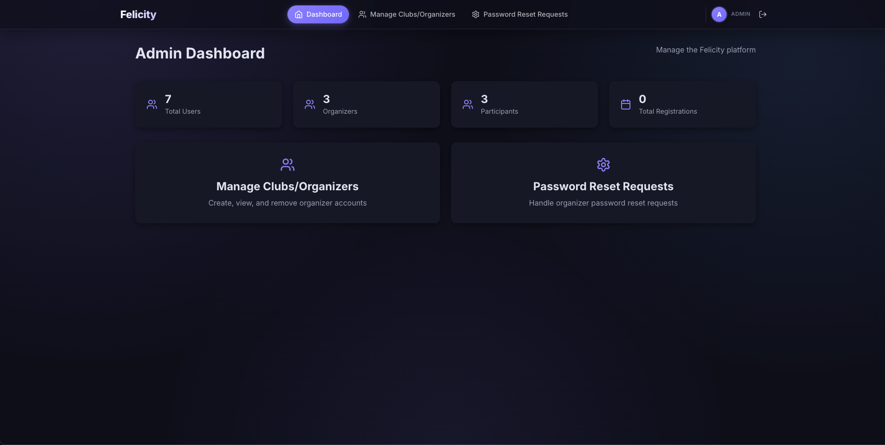
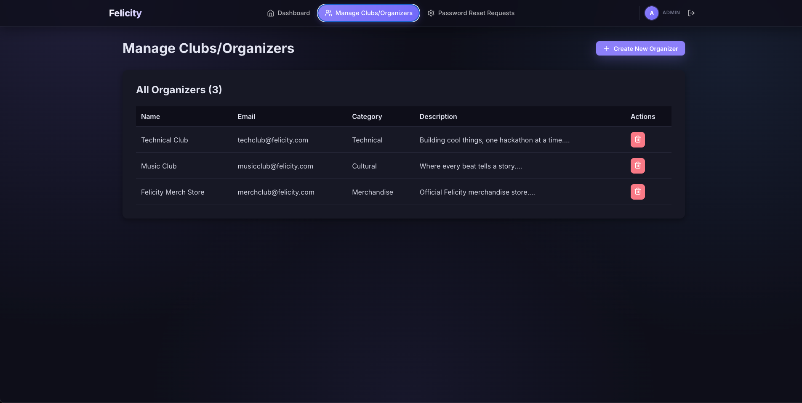
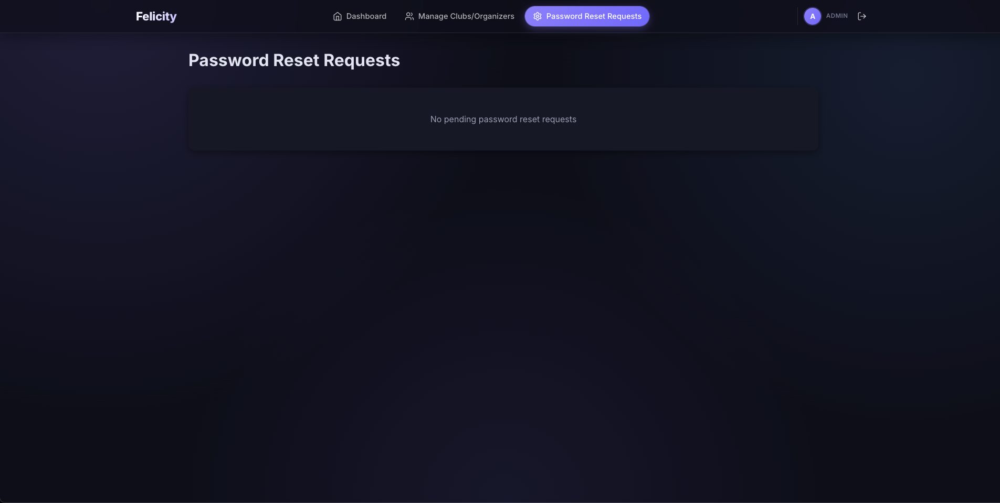
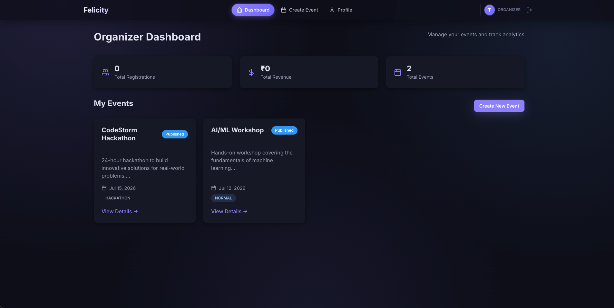
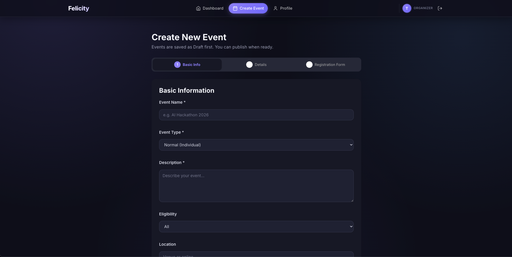
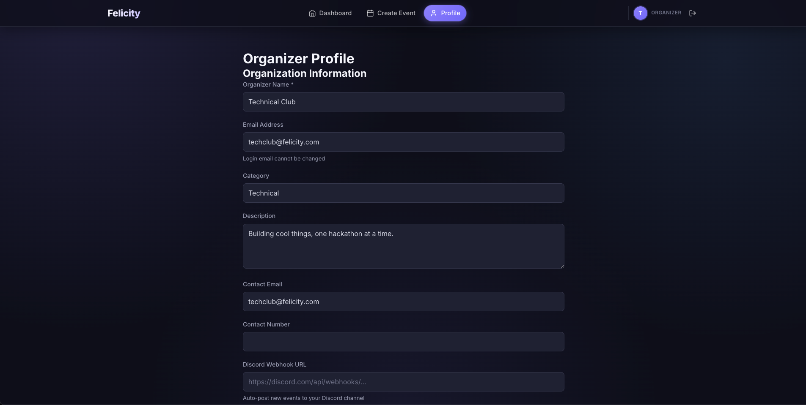
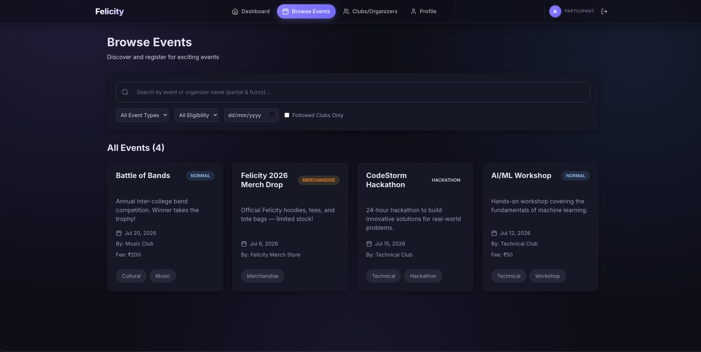
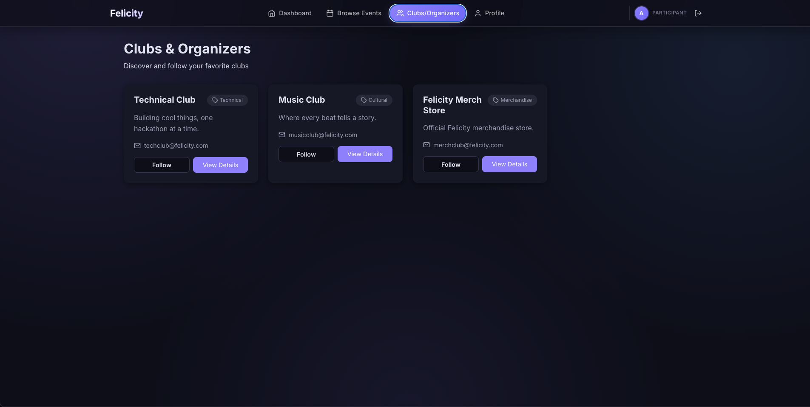
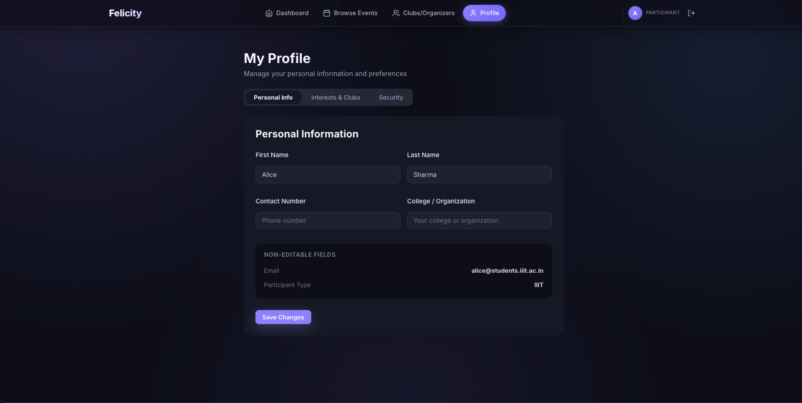
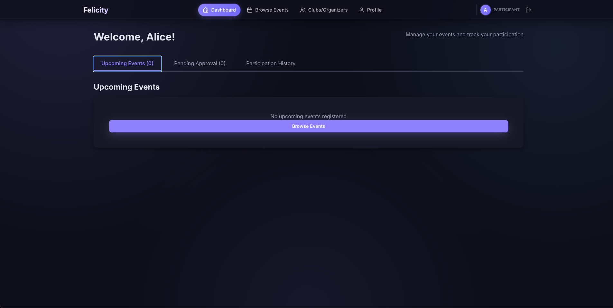

# Felicity — Event Management System

A full-stack event management platform for college fests/clubs, supporting three roles — **Participant**, **Organizer**, and **Admin** — with event creation, registrations, merchandise sales with payment approval, QR-based attendance, a real-time discussion forum, feedback collection, and hackathon team formation.

## About

Felicity lets club organizers create and manage events (normal or merchandise-based with dynamic form builders), lets participants discover, register for, and get tickets to those events, and gives admins control over organizer accounts and password reset requests. Advanced features include a live Socket.io-powered event forum, QR ticket scanning for attendance, and anonymous post-event feedback.

## Tech Stack

**Frontend:** React 18, React Router, Axios, Socket.io Client, lucide-react
**Backend:** Node.js, Express, MongoDB (Mongoose), Socket.io, JWT auth, bcryptjs
**Other:** QR code generation, CSV export (json2csv), Nodemailer

## Deployed Website

- Frontend: [felicity-priyanka1104s-projects.vercel.app](https://felicity-priyanka1104s-projects.vercel.app/login)
- Backend API: [https://dass-assignment-1-hvly.onrender.com](https://dass-assignment-1-hvly.onrender.com)

## Screenshots


### Admin

<table>
<tr><td colspan="3"></td></tr>
<tr>
<td></td>
<td></td>
<td></td>
</tr>
</table>

### Organizer

<table>
<tr><td colspan="3"></td></tr>
<tr>
<td></td>
<td></td>
<td></td>
</tr>
</table>

### Participant

<table>
<tr><td colspan="4"></td></tr>
<tr>
<td></td>
<td></td>
<td></td>
<td></td>
</tr>
</table>

## Running Locally

### Prerequisites
- Node.js v18+
- A MongoDB connection string (Atlas or local)

### 1. Backend

```bash
cd backend
npm install
cp .env.example .env   
npm run create-admin   
npm run dev           
```

### 2. Frontend

```bash
cd frontend
npm install
cp .env.example .env   
npm start              
```

Keep both servers running. 
